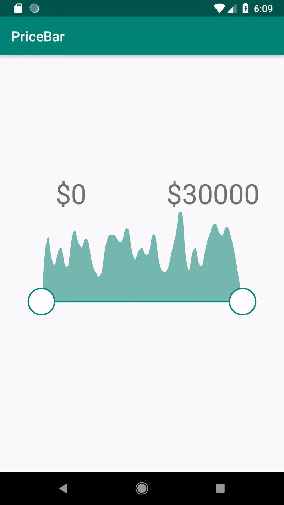

# Setting parameter

```kotlin
priceBar.step = 1000
priceBar.thumbStep = 100
priceBar.maxPrice = 30000
val list = mutableListOf<PriceDto>()
for (i in 0 until 500) {
    val price = (0..29000).random()
    val priceCount = (1..2).random()
    list.add(PriceDto(price, priceCount))
}
priceBar.prices = list
```

# Listener
```kotlin
priceBar.onChangeListener = {
    leftPrice.text = "\$${it.left}"
    rightPrice.text = "\$${it.right}"
}
```



